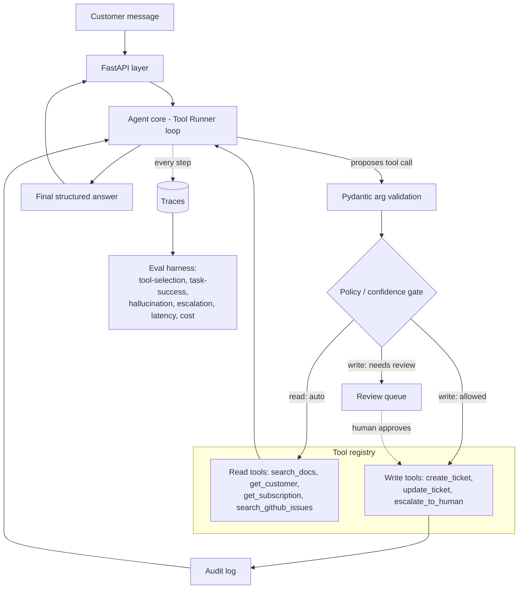

# AgentOps — AI Support Engineer: Architecture

An AI support **agent** (not a chatbot) that answers customer messages and *takes actions* — looking up accounts, searching docs and known issues, creating/updating tickets — behind a confidence/policy gate that decides when to act autonomously and when to hand off to a human. Every decision is logged, replayable, and scored by an eval harness.

> **Design target:** applied-AI / AI-engineer roles, leaning into backend reliability as the differentiator. The same codebase serves backend/platform roles — only the README emphasis changes. Assumed until decided otherwise.

---

## 1. Design principles

1. **Eval-first.** The measure → diagnose → improve loop is the product. Every agent run is a recorded, replayable trace; the eval harness is not an afterthought, it's built in Phase 1 and drives every later decision.
2. **Spine-first.** Thinnest end-to-end path (3 read tools, SQLite, one escalation route) before any breadth. Get a baseline number, then improve it.
3. **Own the harness.** We build the agent loop ourselves (Claude API + Tool Runner), not a managed platform — the reliability, audit, and policy work *is* the portfolio signal. Using Managed Agents would hide exactly the engineering worth showing.
4. **Backend reliability is the edge.** Idempotent writes, a trustworthy audit log, transactional ticket updates, typed validation as a first-class failure mode. A pure-ML applicant can't do this half; lean into it.
5. **Every factual claim traces to a tool result.** Reuse the CiteRAG citation discipline — the agent may only assert what a tool returned. This makes "hallucination" measurable rather than vibes.

---

## 2. Why this stack (and why not the obvious alternatives)

| Decision | Choice | Why |
|---|---|---|
| Agent surface | **Claude API + Tool Runner** (`client.beta.messages.tool_runner`) | Anthropic SDK drives the request→execute→loop cycle, with **per-turn hooks** for approval gates, validation, logging, and result modification — which is exactly where the policy gate and audit log live. You own the compute and the tools. |
| Orchestration framework | **None day 1** (Tool Runner covers the loop) | LangGraph is a Phase 4 *comparison*, not a dependency. Hand-rolling the loop in Phase 0 (a `while stop_reason == "tool_use"` loop) proves you understand the primitives; the Tool Runner is the production path. Don't let a framework be the thing you're demonstrating. |
| Managed Agents | **Not used** | It hosts the loop *and* the sandbox — hiding the audit/policy/infra work that is the whole point here. |
| DB | **SQLAlchemy → SQLite (dev) / Postgres (prod)** | Docker Desktop won't run on this Win11 Home box, so `docker-compose` Postgres is out for local dev. SQLite dev + Postgres in CI/prod is a connection-string swap and dodges the constraint cleanly. |
| Redis | **Cut for v1** | No real job yet. Add only if rate limiting or cross-request caching appears, and only when you can name why. |
| Model | **`claude-opus-5`** default; `claude-sonnet-5` as a config-level cost/latency lever at volume | Model is one config value. Default to the most capable; switching to Sonnet 5 (cheaper, near-Opus on agentic work) is a deliberate cost decision, not a silent downgrade. |

---

## 3. High-level architecture



**Data flow in one line:** message → validate args → policy gate (reads auto-run; writes are allowed, or routed to the review queue) → execute + audit → loop → structured answer. The eval harness wraps this by seeding DB state per scenario and scoring the resulting trace.

---

## 4. Components

### 4.1 API layer (FastAPI)
- `POST /conversations` — start a conversation (customer_id/email).
- `POST /conversations/{id}/messages` — send a customer message, get the agent's response.
- `GET  /conversations/{id}` — history + trace.
- `GET  /reviews` / `POST /reviews/{id}/approve|reject` — human review queue (backend-only; no UI needed for v1, and a clean API reads better than a half-built React panel).
- `POST /internal/eval/run` — kick a scenario/suite (dev only).
- Auth: API key for the demo, structured so a real authz layer can slot in.

### 4.2 Agent core
- Built on the **Tool Runner**. The reasoning loop (receive → build context → LLM proposes tool calls → validate → gate → execute → feed results back → repeat until final answer or escalation) is driven by the SDK.
- Wrapped behind an `AgentRunner` interface so a Phase-4 LangGraph reimplementation can be swapped in *without touching tools or evals* — and you can show the eval numbers hold across both.
- **Final output is structured** (`output_config.format`): `{ answer, citations[], confidence, proposed_actions[], should_escalate, escalation_reason }`. This makes the answer machine-checkable by the eval harness.
- Handle `stop_reason == "refusal"` before reading content (guard, don't crash).

### 4.3 Tool registry + tool contracts
Each tool has: name, description, Pydantic-validated arg schema (`strict: true`), return schema, a **side-effect class** (`read` | `write`), and a permission level. The side-effect class is what drives the policy gate.

| Tool | Class | Args (abridged) | Notes |
|---|---|---|---|
| `search_docs` | read | `query`, `top_k=5` | RAG over help center — **reuse CiteRAG**; returns passages + citations |
| `get_customer` | read | `customer_id \| email` | mock CRM lookup |
| `get_subscription` | read | `customer_id` | plan / billing state |
| `search_github_issues` | read | `query`, `state="open"` | surface known bugs |
| `create_ticket` | write | `customer_id`, `subject`, `body`, `priority`, `idempotency_key` | idempotent |
| `update_ticket` | write | `ticket_id`, `status?`, `priority?`, `note?`, `idempotency_key` | idempotent |
| `escalate_to_human` | write | `conversation_id`, `reason`, `summary` | routes to review queue; terminal |

**Backend reliability specifics (the edge):**
- **Idempotency** — write tools take an `idempotency_key`; a repeat key returns the original result instead of double-creating.
- **Validation is a measured failure mode** — arg validation failures are caught, logged, and counted, never crash the loop.
- **Every tool call is audited** — inputs, outputs, latency, tokens, success/error → `audit_log` (append-only) + `agent_steps` trace.

### 4.4 Policy / confidence gate — *the hard, differentiating part*
Runs after arg validation, before any **write** executes (reads auto-run). Implemented as a **tool middleware** wrapping each write tool (clean, unit-testable, independent of the LLM).

Decision inputs:
1. **Side-effect class** — reads auto; writes evaluated.
2. **Business rules** (deterministic, highest priority) — e.g. *refunds/billing changes always escalate*, *enterprise-tier accounts require review for any write*, *ticket priority ≥ P1 requires review*.
3. **Confidence signal** — recommend **rules + structured self-assessment** (the agent's own `confidence` field), not raw model self-report alone. Thresholds are **tuned empirically** against the escalation-accuracy metric — the measure→diagnose→improve loop applied to the policy layer itself. (A separate LLM-judge confidence check is a possible upgrade, not v1.)

Outcomes: `auto_execute` | `route_to_review` | `block`. Review = a row in `review_queue` + the `GET/POST /reviews` endpoints. Defining *when to escalate* well is the most impressive and hardest piece — treat escalation accuracy as a first-class metric.

### 4.5 Persistence
SQLAlchemy models; SQLite (dev) / Postgres (prod) via connection string.

- `conversations` (id, customer_id, status, created_at)
- `messages` (id, conversation_id, role, content, created_at)
- `agent_steps` (id, conversation_id, step_no, thought, tool_name, tool_args, tool_result, latency_ms, input_tokens, output_tokens, cache_read_tokens, model, created_at) — **trace backbone + eval data source**
- `customers`, `subscriptions` (seeded mock CRM)
- `tickets` (id, customer_id, status, subject, body, priority, created_at)
- `review_queue` (id, conversation_id, proposed_action, status, reason, created_at, resolved_at)
- `audit_log` (append-only: actor, action, target, payload_hash, created_at)
- `eval_runs`, `eval_results` (scorecards, diffable across runs)

### 4.6 Observability
- Structured JSON logging (`structlog`), one `trace_id` per run, every step recorded to `agent_steps`.
- Metrics surfaced from traces: per-conversation cost (tokens × price, incl. cache reads), latency p50/p95, tool-call counts. OpenTelemetry export is a later nice-to-have; the DB-backed trace is enough for v1 and is what powers evals.

### 4.7 Eval harness — *the star of the show*
- `scenarios/` — 50–100 test conversations as data (YAML): customer message(s), seeded CRM/subscription/ticket state, and **expected outcome** (expected tool set/sequence, expected final action, gold answer or rubric, `should_escalate` label).
- **Runner**: resets DB to the scenario's seed → runs the agent → records the trace → scores.
- **Metrics (defined precisely):**
  - **Tool-selection accuracy** — did it call the right tools? (per-tool precision/recall over tool names; sequence match where order matters)
  - **Task-success rate** — correct final outcome? (exact match for actions; LLM-judge/rubric for free-text answers)
  - **Hallucination rate** — fraction of factual claims *not* grounded in a tool result (LLM-judge against retrieved context — the CiteRAG citation check)
  - **Escalation accuracy** — precision/recall on the `should_escalate` label (should have escalated and did / shouldn't have and didn't)
  - **Latency & cost** — from traces (`count_tokens` for estimates, `usage` for actuals)
- **LLM-as-judge** (`claude-opus-5`) for the fuzzy metrics, with its own rubric, **spot-checked against ~human labels** so the judge itself is validated.
- Output: a JSON + Markdown scorecard, diffable across runs — this is what produces *"68% → X%"*.

---

## 5. Anthropic API specifics

- **Model:** default `claude-opus-5`; `claude-sonnet-5` as a config option for high-volume/low-latency (note Sonnet 5 intro pricing through 2026-08-31). `claude-haiku-4-5` is a candidate only if you later add a cheap router/first-pass.
- **Tool Runner hooks** are where the policy gate + audit log attach — gate inside each write tool's function (return a "pending review" result) or inspect yielded messages before execution.
- **Prompt caching** (`cache_control: {type: "ephemeral"}`) on the stable prefix (system prompt + tool definitions) — a major cost lever for a high-volume agent. Verify with `usage.cache_read_input_tokens`; a zero there across identical-prefix runs means a silent invalidator (e.g. a timestamp in the system prompt).
- **Structured outputs** — `strict: true` on tool schemas (guarantees valid args); `output_config.format` for the final decision object.
- **Cost metric** — `client.messages.count_tokens` for estimates (never `tiktoken`), `response.usage` for actuals.
- **Effort/thinking** — adaptive thinking on by default on Opus 5; `output_config.effort` (start `medium`) is the latency/cost dial.

---

## 6. Build order (spine-first)

| Phase | Deliverable | Why |
|---|---|---|
| **0 — Spine** | FastAPI + SQLite + agent loop (hand-rolled first to learn the primitives, then Tool Runner) + 3 read tools + `agent_steps` trace. One conversation end-to-end. | Prove the path works. |
| **1 — Eval harness** | 15–20 scenarios + scorer for tool-selection & task-success. **Get the baseline number.** | This is where the interview story starts. |
| **2 — Actions + policy** | `create_ticket`/`update_ticket` (idempotent), `escalate_to_human`, policy gate + review queue, audit log. Add escalation-accuracy metric. | The differentiating layer. |
| **3 — Harden + scale** | Swap Postgres, add `search_github_issues`, add hallucination + cost/latency metrics, expand to 50–100 scenarios, add prompt caching, write the **error-analysis writeup**. | Production polish + the full scorecard. |
| **4 — Optional** | Reimplement `AgentRunner` on LangGraph behind the same interface; show eval numbers are stable. Or a thin review-queue UI. | "I know the primitives *and* the framework." |

---

## 7. Repo layout

```
agentops/
├── app/
│   ├── api/            # FastAPI routers
│   ├── agent/          # AgentRunner, system prompt, Tool Runner wiring
│   ├── tools/          # one module per tool + registry + policy middleware
│   ├── policy/         # gate rules + confidence thresholds
│   ├── db/             # SQLAlchemy models, Alembic migrations
│   ├── observability/  # structlog config, trace helpers, cost/latency calc
│   └── config.py       # pydantic-settings
├── evals/
│   ├── scenarios/      # *.yaml
│   ├── runner.py       # seed → run → score
│   ├── scorers/        # tool_selection, task_success, hallucination, escalation
│   └── judge.py        # LLM-as-judge + rubric
├── tests/              # pytest; evals runnable in CI
└── ARCHITECTURE.md     # this file
```

---

## 8. Out of scope for v1 (deliberately)
- Redis, LangGraph, OpenTelemetry, a polished review UI, multi-tenant authz, streaming responses to the client. Each is addable later with a stated reason — resisting them now is the point.
